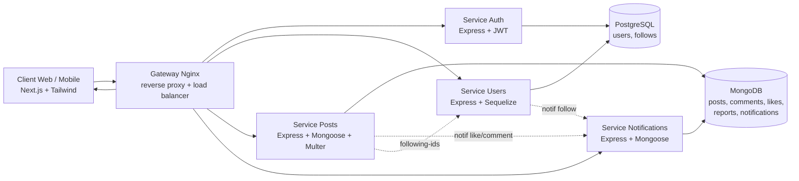

# Spécifications technico-fonctionnelles — Breezy

> **Projet** : Breezy — réseau social léger (PGE A3 FISA INFO, module *Développement d'applications distribuées*)
> **Type** : Document de conception et de réalisation (implémentation)
> **Version** : 1.0 · **Statut** : livré
> Ce document décrit **ce qui a été réalisé** et **comment**, en regard du cahier des charges.

---

## Table des matières

1. [Objet et portée](#1-objet-et-portée)
2. [Vue d'ensemble de l'architecture](#2-vue-densemble-de-larchitecture)
3. [Découpage en microservices](#3-découpage-en-microservices)
4. [Modèle de données](#4-modèle-de-données)
5. [Couverture fonctionnelle (Fx1 → Fx23)](#5-couverture-fonctionnelle)
6. [Contrôle d'accès (RBAC)](#6-contrôle-daccès-rbac)
7. [Sécurité](#7-sécurité)
8. [API REST — conventions](#8-api-rest--conventions)
9. [Frontend — conception](#9-frontend--conception)
10. [Communication inter-services](#10-communication-inter-services)
11. [Conteneurisation & déploiement](#11-conteneurisation--déploiement)
12. [Exigences non fonctionnelles](#12-exigences-non-fonctionnelles)
13. [DevOps & CI/CD](#13-devops--cicd)
14. [Choix techniques justifiés & axes d'amélioration](#14-choix-techniques-justifiés)

---

## 1. Objet et portée

Ce document spécifie la solution **Breezy** telle qu'implémentée : une application sociale
distribuée permettant l'inscription, la publication de messages courts, l'interaction sociale
(likes, commentaires en thread, follows), la gestion de médias, de tags, de notifications, et
la modération de contenu.

L'implémentation couvre **l'intégralité des fonctionnalités obligatoires (Fx1–Fx11)**, les
fonctionnalités « Should have » (Fx12, Fx13, Fx20, Fx21) et une large partie des « Could have »
(Fx14–Fx16, Fx18, Fx19, Fx23). Le détail figure en [section 5](#5-couverture-fonctionnelle).

---

## 2. Vue d'ensemble de l'architecture

Breezy adopte une **architecture microservices conteneurisée** derrière un **reverse proxy**,
conformément au cahier des charges (§7.1).



**Principes structurants :**

- **Découplage** : chaque service possède son code, son `Dockerfile`, ses dépendances et son
  cycle de vie. Aucun partage de code à la compilation (chaque service est autonome).
- **Stateless** : les services ne conservent aucun état de session en mémoire (l'identité voyage
  dans le JWT), ce qui permet le **scaling horizontal** derrière Nginx.
- **Polyglot persistence** : PostgreSQL pour les données fortement relationnelles (identité,
  graphe social) ; MongoDB pour les données documentaires à fort volume et schéma souple (posts,
  commentaires, notifications).
- **Point d'entrée unique** : le client ne connaît qu'une origine (`:8080`), le gateway route
  vers le bon service. Cela simplifie le CORS et permet le load balancing.

---

## 3. Découpage en microservices

| Service | Port | Persistance | Responsabilité |
|---|---|---|---|
| **gateway** | 8080→80 | — | Reverse proxy, routage `/api/*`, load balancing, en-têtes de sécurité, compression |
| **auth** | 4001 | PostgreSQL | Inscription, connexion, JWT (access + refresh), hachage bcrypt, création admin |
| **users** | 4002 | PostgreSQL | Profils, graphe social (follows), recherche, modération de comptes |
| **posts** | 4003 | MongoDB | Posts, commentaires/threads, likes, tags, signalements, upload médias |
| **notifications** | 4004 | MongoDB | Notifications (like, comment, follow, mention) |
| **frontend** | 3000 | — | Application Next.js (SSR/CSR), access store, contrôle d'accès frontend |

### 3.1 Bornage des contextes (DDD léger)

- L'**identité** (table `users`) est la source de vérité, créée et possédée par le service Auth
  (qui détient seul `passwordHash`). Le service Users opère sur la même table pour les aspects
  **profil** et **statut**, et possède exclusivement la table `follows`. Ce choix « base
  relationnelle partagée entre deux services d'un même contexte identité » est assumé pour le
  cadre pédagogique ; une évolution possible est l'extraction d'un schéma dédié par service.
- Les services **Posts** et **Notifications** partagent l'instance MongoDB mais des **collections
  distinctes** ; chacun ne lit/écrit que ses collections.

### 3.2 Structure type d'un service

```
services/<nom>/
├── Dockerfile
├── healthcheck.js          # sonde Docker (HTTP /health)
├── package.json
└── src/
    ├── index.js            # bootstrap : connexion DB (retry) + sync + listen
    ├── app.js              # app Express (helmet, cors, json, rate-limit, routes)
    ├── config/             # env + connexion base de données
    ├── models/             # Sequelize ou Mongoose
    ├── middleware/         # authenticate, requireRole, validate, errorHandler
    ├── controllers/        # logique métier
    ├── routes/             # définition des endpoints
    └── validators/         # schémas Zod
```

---

## 4. Modèle de données

### 4.1 PostgreSQL (Sequelize)

**Table `users`** (service Auth + Users)

| Colonne | Type | Notes |
|---|---|---|
| `id` | UUID (PK) | généré (UUIDv4) |
| `username` | VARCHAR(30) UNIQUE | `^[a-zA-Z0-9_]{3,30}$` |
| `email` | VARCHAR(255) UNIQUE | validé |
| `passwordHash` | VARCHAR | bcrypt (12 rounds) |
| `role` | ENUM(`user`,`moderator`,`admin`) | défaut `user` |
| `status` | ENUM(`active`,`suspended`,`banned`) | défaut `active` |
| `displayName` | VARCHAR(60) | optionnel |
| `bio` | VARCHAR(160) | optionnel |
| `avatarUrl` | VARCHAR | optionnel |
| `createdAt`/`updatedAt` | TIMESTAMP | timestamps Sequelize |

**Table `follows`** (service Users) — `id (UUID)`, `followerId (UUID)`, `followedId (UUID)`,
timestamps. Index **unique** `(followerId, followedId)` + index sur `followedId`.

### 4.2 MongoDB (Mongoose)

**`posts`** : `authorId`, `authorUsername` (dénormalisés), `content` (≤280), `tags: [String]`,
`media: [{ url, type }]`, `likeCount`, `commentCount`, timestamps. Index `{ createdAt: -1 }` et
`{ authorId, createdAt }`.

**`comments`** : `postId (ObjectId)`, `parentCommentId (ObjectId|null)` (thread, Fx8),
`authorId`, `authorUsername`, `content` (≤280), timestamps.

**`likes`** : `postId`, `userId`, timestamps. Index **unique** `(postId, userId)` (idempotence du like).

**`reports`** : `targetType` (`post`/`comment`/`user`), `targetId`, `reason`, `reporterId`,
`reporterUsername`, `status` (`open`/`reviewed`/`dismissed`), `snapshot` (aperçu dénormalisé).

**`notifications`** : `userId` (destinataire), `type` (`like`/`comment`/`follow`/`mention`),
`actor: { id, username }`, `payload`, `read`, timestamps.

### 4.3 Dénormalisation assumée

`authorUsername` est **copié** dans les posts/commentaires au moment de l'écriture pour éviter un
appel cross-service à chaque lecture du fil (performance, résilience). Les avatars sont **générés
côté client** de façon déterministe à partir du `username` (avatars « lettre » colorés de la
maquette), ce qui supprime le besoin de stocker/transférer des images d'avatar.

---

## 5. Couverture fonctionnelle

| ID | Fonctionnalité | Statut | Où / Comment |
|---|---|---|---|
| **Fx1** | Création de comptes | ✅ | `POST /api/auth/register` + `POST /api/auth/users` (admin) |
| **Fx2** | Authentification sécurisée | ✅ | `POST /api/auth/login` → JWT + cookie refresh |
| **Fx3** | Publication ≤ 280 car. | ✅ | `POST /api/posts` (validation Zod 280) |
| **Fx4** | Affichage/édition sur profil | ✅ | `GET/PATCH/DELETE /api/posts/:id` |
| **Fx5** | Flux chronologique | ✅ | `GET /api/posts/feed` (suivis + soi, tri `createdAt`) |
| **Fx6** | Liker | ✅ | `POST/DELETE /api/posts/:id/like` (idempotent) |
| **Fx7** | Répondre à un post | ✅ | `POST /api/posts/:id/comments` |
| **Fx8** | Répondre à un commentaire | ✅ | idem avec `parentCommentId` (thread) |
| **Fx9** | Suivre / être suivi | ✅ | `POST/DELETE /api/users/:id/follow` |
| **Fx10** | Profil utilisateur | ✅ | `GET /api/users/:username`, `PATCH /api/users/me` |
| **Fx11** | Liste des messages du profil | ✅ | `GET /api/posts/user/:userId` |
| **Fx12** | Tags | ✅ | extraction `#tag` + champ `tags` à la publication |
| **Fx13** | Recherche par tags | ✅ | `GET /api/posts/tag/:tag` + `/tags/trending` |
| **Fx14** | Notifications mentions/commentaires | ✅ | notification `comment` à l'auteur du post |
| **Fx15** | Notifications likes | ✅ | notification `like` à l'auteur |
| **Fx16** | Notifications followers | ✅ | notification `follow` au suivi |
| **Fx17** | Messages privés | ⛔ | hors périmètre retenu (Could have non prioritaire) |
| **Fx18** | Images dans messages | ✅ | `POST /api/posts/upload` (Multer, MIME whitelist) |
| **Fx19** | Vidéos dans messages | ✅ | idem (mp4) |
| **Fx20** | Signalement de contenu | ✅ | `POST /api/posts/reports` |
| **Fx21** | Suspension / bannissement | ✅ | `PATCH /api/users/:id/status` + suppression contenu (mod) |
| **Fx22** | Interface multi-langues | ⚠️ | préparé (UI 100 % FR centralisée) — i18n non branché |
| **Fx23** | Thème personnalisé | ✅ | bascule clair/sombre persistée (`localStorage`) |

Légende : ✅ implémenté · ⚠️ préparé · ⛔ non réalisé (hors périmètre prioritaire).

---

## 6. Contrôle d'accès (RBAC)

Quatre profils : **visitor** (non authentifié), **user**, **moderator**, **admin**.
Le rôle est porté par le claim `role` du JWT et vérifié par le middleware `requireRole(...roles)`
**sur chaque route sensible** (défense côté serveur), et redoublé côté frontend par le hook
`useRequireAuth(roles?)` (défense côté client, masquage + redirection).

| Action | Visitor | User | Moderator | Admin |
|---|:--:|:--:|:--:|:--:|
| S'inscrire / consulter en lecture publique | ✅ | — | — | ✅ |
| Publier, liker, commenter, suivre | ❌ | ✅ | ✅ | ✅ |
| Modifier/supprimer **son** contenu | ❌ | ✅ | ✅ | ✅ |
| Supprimer **tout** contenu signalé | ❌ | ❌ | ✅ | ✅ |
| Suspendre / bannir un compte | ❌ | ❌ | ✅ | ✅ |
| Créer un compte avec rôle | ❌ | ❌ | ❌ | ✅ |

> Un administrateur ne peut pas être modéré (garde-fou explicite côté service Users).

---

## 7. Sécurité

### 7.1 Authentification par jetons (JWT)

- **Access token** : durée courte (15 min), signé HS256 (`JWT_ACCESS_SECRET`), claims minimaux
  `{ sub, username, role }`, conservé **en mémoire** côté client (pas de `localStorage` → réduit
  la surface XSS).
- **Refresh token** : durée longue (7 j), signé avec un **secret distinct**, transporté dans un
  **cookie HttpOnly + SameSite=Lax + Secure** (en prod), restreint au chemin `/api/auth`.
- **Rotation** : chaque `/auth/refresh` réémet un nouveau refresh token.
- Un compte `banned` ne peut ni se connecter ni rafraîchir sa session.

### 7.2 Mots de passe

- Hachage **bcrypt** à **12 rounds**.
- Politique appliquée (Zod) : ≥ 8 caractères, au moins une minuscule, une majuscule, un chiffre.
- Message de connexion **générique** (« identifiant ou mot de passe incorrect ») pour éviter
  l'énumération de comptes.

### 7.3 Durcissement applicatif

| Mesure | Mise en œuvre |
|---|---|
| En-têtes HTTP | **Helmet** sur chaque service + en-têtes au niveau gateway |
| CORS | restreint aux origines de `CORS_ORIGINS`, `credentials: true` |
| Rate limiting | global (120/min) + **strict** sur `login`/`register` (20 / 15 min) |
| Validation des entrées | **Zod** sur tous les bodies ; rejets `422` structurés |
| Injection | ORM/ODM paramétrés (Sequelize/Mongoose) — pas de requête concaténée |
| Upload | whitelist MIME (jpg/png/gif/webp/mp4), taille ≤ 10 Mo, nom de fichier aléatoire |
| Erreurs | middleware centralisé, pas de fuite de stack en réponse |
| Conteneurs | exécution en utilisateur **non-root** |
| Appels internes | clé partagée `x-internal-key` exigée sur les endpoints internes |
| Secrets | variables d'environnement, `.env` git-ignoré, Dependabot actif |

### 7.4 Service tiers d'authentification (notion, §9.3 du cahier)

L'architecture est compatible avec une **fédération OAuth2/OIDC** (Google, GitHub) : le service
Auth deviendrait un *client OIDC* échangeant un code d'autorisation contre un jeton d'identité,
puis émettrait ses propres JWT applicatifs. Non implémenté (évolution), mais le découplage
auth/reste-de-l'app le rend simple à ajouter.

---

## 8. API REST — conventions

- **Versionnable** via le préfixe `/api` (un passage `/api/v1` est trivial au niveau gateway).
- **Verbes** cohérents : `GET` (lecture), `POST` (création), `PATCH` (modification partielle),
  `DELETE` (suppression).
- **Codes HTTP** normalisés (`200/201/400/401/403/404/409/422/429/500`).
- **Enveloppe homogène** : `{ data, error, meta }` — `error: { code, message, details }`.
- **Pagination** par curseur temporel (`?before=<ISO date>`) sur les flux (efficace sur Mongo).
- Référence complète : [`API.md`](API.md).

---

## 9. Frontend — conception

- **Next.js 14 (App Router)**, TypeScript, **mobile-first** (conteneur centré `max-w-[600px]`).
- **Tailwind CSS** : les tokens de la maquette (saphir + brun chaud) sont exposés en **variables
  CSS** ; le mode sombre est piloté par `[data-theme="dark"]` qui redéfinit ces variables — pas
  de duplication de classes.
- **Access store** : `zustand` (`useAuth`) conserve l'utilisateur courant et l'access token ;
  `bootstrap()` restaure la session au chargement via le cookie de refresh.
- **Client HTTP** : `axios` avec **intercepteurs** — injection du `Bearer` et **refresh
  silencieux** sur `401` (rejoue la requête une fois).
- **Composants réutilisables** : `Avatar`, `PostCard` (like optimiste), `BottomNav`, `AppHeader`.
- **Hooks & cycle de vie** : `useEffect` pour le chargement de données, `useRequireAuth` pour la
  garde de route (illustration explicite des règles de composants/hooks du référentiel).
- **Écrans** : accueil/onboarding, connexion, inscription, fil, composer, explorer/recherche,
  thread, profil, notifications, réglages (thème + profil), modération, signalement, tag.

---

## 10. Communication inter-services

Deux mécanismes, tous deux **non bloquants pour l'action utilisateur** :

1. **Construction du fil (Fx5)** : le service Posts interroge le service Users
   (`GET /internal/:id/following-ids`, protégé par `x-internal-key`) pour connaître les comptes
   suivis. En cas d'indisponibilité, le fil se réduit aux posts propres (dégradation gracieuse).
2. **Émission de notifications** : les services Users (follow) et Posts (like, comment) appellent
   `POST /api/notifications/internal`. L'échec d'émission est **journalisé sans interrompre**
   l'action (le like/commentaire/follow reste effectif). Cela illustre l'**isolation des
   défaillances** propre aux microservices.

> Évolution : remplacer ces appels HTTP synchrones par un **bus d'événements** (RabbitMQ/Kafka)
> pour un découplage total et un traitement asynchrone.

---

## 11. Conteneurisation & déploiement

- **Une image par service** + frontend, orchestrées par `docker-compose.yml`.
- **Volumes nommés** : `pgdata`, `mongodata` (persistance), `uploads` (médias).
- **Réseau** Docker dédié `breezy-net` (isolation inter-services).
- **Healthchecks** sur chaque service (`healthcheck.js` HTTP) et sur les bases (`pg_isready`,
  `mongosh ping`) ; `depends_on: condition: service_healthy` garantit l'ordre de démarrage.
- **`restart: unless-stopped`** pour la résilience.
- **Load balancing** : `docker compose up --scale posts=3` → Nginx répartit en round-robin
  (les `upstream` se résolvent via le DNS Docker).
- **Frontend** : build multi-étapes, sortie **standalone** (image finale légère, user non-root).

### Environnements visés

| Environnement | Mise en œuvre |
|---|---|
| Local / Dev | `docker compose up` (hot reload possible via `npm run dev` par service) |
| Test / CI | pipeline GitHub Actions éphémère |
| Staging / Démo | `docker compose` sur un hôte unique (VM/cloud) |
| Production (cible) | orchestration Docker Swarm / Kubernetes (évolution) |

---

## 12. Exigences non fonctionnelles

| Propriété | Réponse apportée |
|---|---|
| **Fiabilité** | Gestion d'erreurs centralisée, réponses typées, retry de connexion DB, refresh silencieux côté client |
| **Performance** | Index Mongo/PG ciblés, pagination par curseur, dénormalisation auteur, gzip au gateway, claims JWT minimaux |
| **Disponibilité** | Healthchecks + `restart` + dégradation gracieuse (fil/notifs) |
| **Scalabilité** | Services **stateless** → scaling horizontal via Nginx |
| **Connectivité** | Origine unique, CORS explicite, HTTPS en prod (terminaison TLS au gateway) |
| **Évolutivité** | Découpage microservices, contrats `/api` versionnables, ORM/ODM pour migrations |
| **Accessibilité** | Mobile-first, contrastes du design system, `aria-label` sur les actions iconographiques, navigation clavier |
| **Internationalisation** | Textes FR centralisés, structure prête pour i18n |

---

## 13. DevOps & CI/CD

- **Gitflow** : `main`, `develop`, `feature/*`, `fix/*`, `release/*`, `hotfix/*`.
- **Conventional Commits** : `feat:`, `fix:`, `docs:`, `refactor:`, `test:`, `chore:`, `ci:`.
- **GitHub Actions** (`.github/workflows/ci.yml`) :
  1. Lint/contrôle syntaxe + tests des 4 services (matrice),
  2. Lint + build du frontend,
  3. `docker compose build` de l'ensemble (vérifie la cohérence des images).
- **Dependabot** (`.github/dependabot.yml`) : écosystèmes `npm`, `docker`, `github-actions`.
- **Kanban** GitHub Projects (À faire / En cours / Terminé / Blocage) — au niveau organisation.

---

## 14. Choix techniques justifiés

| Décision | Justification |
|---|---|
| Microservices dès le départ | Objectif pédagogique explicite (architectures distribuées, load balancing) ; démarrage à 4 services pour rester maîtrisable (cf. mitigation « sur-ingénierie »). |
| Double persistance PG + Mongo | Imposé par le cahier ; pertinent : graphe social relationnel ↔ contenus documentaires. |
| JWT access **en mémoire** + refresh **cookie HttpOnly** | Meilleur compromis sécurité/UX : limite XSS (pas de token en localStorage) et CSRF (SameSite). |
| Dénormalisation `authorUsername` | Évite N appels cross-service à la lecture du fil ; gain de performance et de résilience. |
| Avatars « lettre » générés | Fidélité à la maquette + zéro coût de stockage/transfert d'images d'avatar. |
| Zod pour la validation | Schémas typés, messages clairs, nettoyage des entrées avant la couche métier. |
| Notifications via appel HTTP interne | Simple et explicite pour le cadre pédagogique ; chemin d'évolution clair vers un bus d'événements. |

### Axes d'amélioration (roadmap)

- Messages privés (Fx17) et i18n effective (Fx22).
- Bus d'événements asynchrone (RabbitMQ/Kafka) pour les notifications.
- Notifications **temps réel** (WebSockets/SSE).
- Authentification fédérée **OAuth2/OIDC**.
- Recherche full-text (Meilisearch/Elasticsearch) au-delà des tags.
- Observabilité (Prometheus/Grafana, logs centralisés) et orchestration Kubernetes.
- Tests automatisés étendus (unitaires + intégration + e2e).

---

*Document de référence d'implémentation — à versionner dans `/docs` et à présenter en soutenance.*
