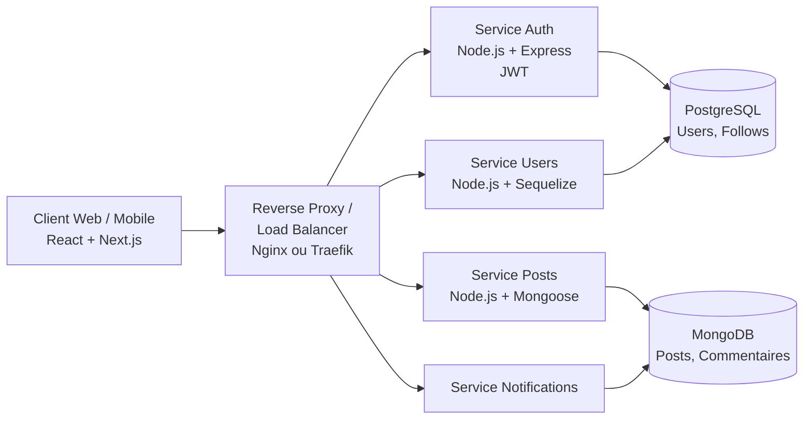

> **Module** : Développement d'applications distribuées (PGE A3 FISA INFO)
> **Type de document** : Cahier des charges fonctionnel et technique
> **Version** : 1.0
> **Date** : 03 juin 2026
> **Statut** : Document de référence projet

---

## Table des matières

1. [Contexte et présentation du projet](#1-contexte-et-présentation-du-projet)
2. [Objectifs](#2-objectifs)
3. [Périmètre du projet](#3-périmètre-du-projet)
4. [Acteurs et parties prenantes](#4-acteurs-et-parties-prenantes)
5. [Spécifications fonctionnelles](#5-spécifications-fonctionnelles)
6. [Matrice des permissions (RBAC)](#6-matrice-des-permissions-rbac)
7. [Spécifications techniques et architecture](#7-spécifications-techniques-et-architecture)
8. [Exigences non fonctionnelles](#8-exigences-non-fonctionnelles)
9. [Sécurité](#9-sécurité)
10. [Méthodologie, organisation et DevOps](#10-méthodologie-organisation-et-devops)
11. [Environnements et déploiement](#11-environnements-et-déploiement)
12. [Livrables et soutenance](#12-livrables-et-soutenance)
13. [Risques et axes d'amélioration](#13-risques-et-axes-damélioration)
14. [Annexes](#14-annexes)

---

## 1. Contexte et présentation du projet

### 1.1 Contexte général

Le développement d'applications distribuées constitue aujourd'hui un enjeu majeur de l'ingénierie logicielle. Les produits modernes doivent fonctionner sur une grande diversité de supports (desktop, mobile, tablette) et d'environnements hétérogènes (On Premise, Private Cloud, Public Cloud). Ils doivent en outre s'adapter en permanence à des besoins utilisateurs en évolution constante, ce qui impose **agilité, livraisons itératives et automatisation**.

Cette exigence s'accompagne de plusieurs défis :

- La dissociation entre frontend, backend et bases de données, avec des équipes spécialisées,
- La multiplication de tâches manuelles répétitives à faible valeur ajoutée,
- La nécessité de garantir l'interopérabilité, la fiabilité et l'évolutivité du produit.

C'est dans ce cadre que s'inscrit la démarche **Agile + DevOps** (CALMS : *Culture, Automation, Lean, Measurement, Sharing*) qui structure ce projet.

### 1.2 Présentation de Breezy

**Breezy** est un réseau social léger et réactif, inspiré de Twitter/X, mais **optimisé pour des environnements à faibles ressources**. Il permet aux utilisateurs de publier des messages courts, d'interagir entre eux (likes, commentaires, follows) et de bénéficier d'une expérience fluide et rapide, quelle que soit la qualité du support ou du réseau.

L'application est conçue selon une architecture **microservices conteneurisée**, exposée via une **API RESTful**, avec un frontend React/Next.js en approche **mobile-first**.

---

## 2. Objectifs

### 2.1 Objectifs métier

- Proposer une plateforme sociale **simple, rapide et accessible**, y compris sur des terminaux modestes.
- Offrir une expérience utilisateur cohérente sur desktop, tablette et mobile (responsive, mobile-first).
- Garantir la **sécurité des échanges et des données** utilisateurs.

### 2.2 Objectifs pédagogiques

Le projet couvre les compétences suivantes du référentiel :

#### Spécifications techniques et architectures
- Expliquer les architectures logicielles adaptées (monolithique → microservices).
- Représenter et argumenter l'architecture retenue.
- Citer les types d'infrastructures de déploiement (On Premise, Private/Public Cloud).
- Définir les propriétés non fonctionnelles (fiabilité, performance, disponibilité, scalabilité, connectivité, évolutivité).
- Appliquer les bonnes pratiques de déploiement d'API REST en Node.js.
- Utiliser un ORM JavaScript (Sequelize, Mongoose).

#### Développement d'applications distribuées web
- Construire et manipuler des données JSON.
- Utiliser un framework frontend (React / Next.js).
- Utiliser une librairie de style (Tailwind CSS).
- Réaliser la modélisation d'une application frontend.
- Maîtriser les cycles de vie et règles de création de composants.
- Développer des composants réutilisables et interagir via les hooks.
- Mettre en place JWT pour l'authentification.
- Employer un access store et un système de loadbalancing/routage.

#### Sécurité des applications
- Réaliser un système d'authentification dans une API.
- Mettre en place le contrôle d'accès backend et frontend.
- Gérer la sécurité par jetons (JWT).
- Expliquer un service tiers d'authentification.

---

## 3. Périmètre du projet

### 3.1 Inclus dans le périmètre (In Scope)

- Conception et développement complets du backend (API REST) et du frontend (SPA/SSR).
- Mise en œuvre d'une base de données relationnelle (PostgreSQL) et/ou documentaire (MongoDB).
- Conteneurisation de l'ensemble des services via Docker / Docker Compose.
- Authentification et autorisation par JWT, avec gestion de rôles.
- Mise en place d'une démarche DevOps : Gitflow, Conventional Commits, Kanban, Pull Requests, CI/CD via GitHub Actions.
- Documentation (README, schémas d'architecture, wireframes, rapport final).

### 3.2 Hors périmètre (Out of Scope)

- Déploiement en production sur une infrastructure cloud publique facturée.
- Application native mobile (iOS/Android).
- Modération automatisée par IA.
- Monétisation, publicité, analytics avancés.

---

## 4. Acteurs et parties prenantes

| Acteur | Rôle |
|---|---|
| **Équipe projet (DAD-groupe-X)** | Conception, développement, livraison, soutenance |
| **Pilote / Référent CESI** | Owner GitHub, accompagnement pédagogique, jury |
| **Jury de soutenance** | Évaluation du projet et des compétences individuelles |
| **Utilisateurs finaux (cibles)** | Visiteurs, Utilisateurs, Modérateurs, Administrateurs |

### 4.1 Profils utilisateurs

- **Visiteur** : non authentifié, peut créer un compte et personnaliser le thème.
- **Utilisateur** : authentifié, accède à l'ensemble des fonctionnalités sociales.
- **Modérateur** : peut suspendre/bannir des utilisateurs et modérer les contenus signalés.
- **Administrateur** : dispose de l'ensemble des droits, y compris la création de comptes.

---

## 5. Spécifications fonctionnelles

### 5.1 Fonctionnalités primaires (obligatoires)

| ID | Fonctionnalité | User Story |
|----|----------------|------------|
| **Fx1** | Création de comptes avec validation | En tant que visiteur, je veux créer un compte pour accéder à la plateforme. |
| **Fx2** | Authentification sécurisée | En tant qu'utilisateur, je veux me connecter de manière sécurisée. |
| **Fx3** | Publication de messages courts | Publier des messages ≤ 280 caractères. |
| **Fx4** | Affichage des messages sur le profil | Consulter et modifier mes messages depuis mon profil. |
| **Fx5** | Flux chronologique | Fil d'actualité des utilisateurs suivis. |
| **Fx6** | Liker un post | Montrer mon appréciation d'un message. |
| **Fx7** | Répondre à un post (commentaire) | Réagir publiquement à un post. |
| **Fx8** | Répondre à un commentaire | Participer à une discussion en thread. |
| **Fx9** | Suivre / être suivi | Construire son réseau social. |
| **Fx10** | Profil utilisateur | Nom, biographie courte, photo de profil. |
| **Fx11** | Liste des messages sur le profil | Historique complet des publications. |

### 5.2 Fonctionnalités secondaires (optionnelles)

| ID | Fonctionnalité |
|----|----------------|
| Fx12 | Ajout de tags aux messages |
| Fx13 | Recherche par tags |
| Fx14 | Notifications de mentions |
| Fx15 | Notifications de likes |
| Fx16 | Notifications de nouveaux followers |
| Fx17 | Messages privés entre utilisateurs |
| Fx18 | Ajout d'images aux messages |
| Fx19 | Ajout de vidéos aux messages |
| Fx20 | Signalement de contenu inapproprié |
| Fx21 | Suspension / bannissement (modérateur) |
| Fx22 | Interface multi-langues |
| Fx23 | Thème personnalisé |

### 5.3 Hiérarchisation (MoSCoW)

- **Must have** : Fx1 → Fx11 (cœur fonctionnel obligatoire).
- **Should have** : Fx12, Fx13, Fx20, Fx21 (qualité de service et modération).
- **Could have** : Fx14 → Fx19, Fx22, Fx23 (enrichissement UX).
- **Won't have (cette itération)** : application native, IA de modération.

---

## 6. Matrice des permissions (RBAC)

| Fonctionnalité | Visiteur | Utilisateur | Modérateur | Administrateur |
|---|:---:|:---:|:---:|:---:|
| Fx1. Création de comptes | ✅ | ❌ | ❌ | ✅ |
| Fx2. Authentification | ❌ | ✅ | ✅ | ✅ |
| Fx3. Publication de messages | ❌ | ✅ | ✅ | ✅ |
| Fx4. Affichage messages sur profil | ❌ | ✅ (le sien) | ✅ | ✅ |
| Fx5. Flux chronologique | ❌ | ✅ | ✅ | ✅ |
| Fx6. Liker un post | ❌ | ✅ | ✅ | ✅ |
| Fx7. Répondre à un post | ❌ | ✅ | ✅ | ✅ |
| Fx8. Répondre à un commentaire | ❌ | ✅ | ✅ | ✅ |
| Fx9. Suivre / être suivi | ❌ | ✅ | ✅ | ✅ |
| Fx10. Profil utilisateur | ❌ | ✅ | ✅ | ✅ |
| Fx11. Liste des messages | ❌ | ✅ | ✅ | ✅ |
| Fx12. Tags | ❌ | ✅ | ✅ | ✅ |
| Fx13. Recherche par tags | ❌ | ✅ | ✅ | ✅ |
| Fx14. Notifications mentions | ❌ | ✅ | ✅ (modération) | ✅ (admin) |
| Fx15. Notifications likes | ❌ | ✅ | ❌ | ❌ |
| Fx16. Notifications followers | ❌ | ✅ | ❌ | ❌ |
| Fx17. Messages privés | ❌ | ✅ | ✅ | ✅ |
| Fx18. Images dans messages | ❌ | ✅ | ✅ | ✅ |
| Fx19. Vidéos dans messages | ❌ | ✅ | ✅ | ✅ |
| Fx20. Signalement de contenu | ❌ | ✅ | ✅ | ✅ |
| Fx21. Suspension / bannissement | ❌ | ❌ | ✅ | ✅ |
| Fx22. Interface multi-langues | ❌ | ✅ | ✅ | ✅ |
| Fx23. Thème personnalisé | ✅ | ✅ | ✅ | ✅ |

---

## 7. Spécifications techniques et architecture

### 7.1 Choix d'architecture

L'application adopte une **architecture en microservices conteneurisés** plutôt qu'un monolithe, pour les raisons suivantes :

| Critère | Monolithique | Microservices (retenu) |
|---|---|---|
| Couplage | Fort | Faible |
| Scalabilité | Globale uniquement | Par service (horizontale ciblée) |
| Déploiement | Bloc unique | Indépendant par service |
| Résilience | Panne globale | Isolation des défaillances |
| Complexité initiale | Faible | Plus élevée (justifiée pédagogiquement) |

**Justification** : le projet vise explicitement la maîtrise des architectures distribuées, du loadbalancing et de la conteneurisation. Le découpage en microservices permet d'illustrer concrètement ces compétences.

### 7.2 Vue d'ensemble

### 7.3 Stack technique

#### Back-end
- **Runtime** : Node.js (LTS)
- **Framework** : Express.js
- **Authentification** : JWT (JSON Web Tokens)
- **Bases de données** :
  - **PostgreSQL** via **Sequelize** (données relationnelles : users, follows, rôles)
  - **MongoDB** via **Mongoose** (données documentaires : posts, commentaires, notifications)
- **Sécurité** : middlewares CORS, Helmet, validation des entrées, gestion centralisée des erreurs.

#### Front-end
- **Framework** : React.js + **Next.js** (SSR/SSG selon les pages)
- **Style** : **Tailwind CSS** (utility-first, mobile-first)
- **HTTP client** : Axios (interceptors pour JWT)
- **Routage** : React Router / routage Next.js natif
- **State management** : access store (Context API, Zustand ou Redux Toolkit) pour la session et les données partagées.

#### Infrastructure
- **Conteneurisation** : Docker, Docker Compose
- **Reverse proxy / Load balancing** : Nginx ou Traefik
- **Registry** : Docker Hub
- **CI/CD** : GitHub Actions
- **Surveillance dépendances** : Dependabot

### 7.4 Bonnes pratiques d'API REST (Node.js)

- Versionnage des routes (`/api/v1/...`).
- Verbes HTTP cohérents (`GET`, `POST`, `PUT`, `PATCH`, `DELETE`).
- Codes de statut HTTP normalisés (`200`, `201`, `204`, `400`, `401`, `403`, `404`, `409`, `422`, `500`).
- Format de réponse JSON homogène (`{ data, error, meta }`).
- Pagination, tri et filtrage standardisés.
- Documentation OpenAPI / Swagger.
- Validation systématique des entrées (`zod`, `joi` ou `express-validator`).
- Logs structurés et middleware d'erreurs centralisé.

### 7.5 Utilisation des ORM JavaScript

- **Sequelize** (SQL/PostgreSQL) : modèles, migrations, associations (`hasMany`, `belongsTo`), seeders, transactions.
- **Mongoose** (MongoDB) : schémas typés, validators, hooks (`pre`/`post`), population des références.
- Bénéfices : abstraction du SQL/Mongo natif, sécurité (anti-injection), portabilité, maintenabilité.

### 7.6 Modèle de données (extrait)

- **User** : `id, username, email, passwordHash, role, bio, avatarUrl, createdAt`
- **Follow** : `followerId, followedId, createdAt`
- **Post** : `_id, authorId, content (≤280), tags[], mediaUrls[], createdAt`
- **Comment** : `_id, postId, parentCommentId?, authorId, content, createdAt`
- **Like** : `_id, postId, userId, createdAt`
- **Notification** : `_id, userId, type, payload, read, createdAt`

---

## 8. Exigences non fonctionnelles

| Propriété | Exigence |
|---|---|
| **Fiabilité** | Taux d'erreur API < 1 %. Gestion d'erreurs centralisée, retries côté client sur erreurs réseau. |
| **Performance** | Temps de réponse API médian < 200 ms ; TTI front < 3 s sur réseau 3G. |
| **Disponibilité** | Cible 99 % en environnement de démonstration ; healthchecks Docker. |
| **Scalabilité** | Horizontale par service via le reverse proxy / load balancer. Services stateless. |
| **Connectivité** | API REST exposée via HTTPS (en prod), CORS configuré explicitement. |
| **Évolutivité** | Découpage microservices, contrats API versionnés, ORM pour faciliter migrations de schéma. |
| **Accessibilité** | Mobile-first, responsive, contraste suffisant, navigation clavier. |
| **Internationalisation** | Préparation i18n (Fx22). |

---

## 9. Sécurité

### 9.1 Authentification & autorisation

- **JWT** signés (HS256 ou RS256), `accessToken` court (15 min) + `refreshToken` long (7 j) en cookie HttpOnly/Secure.
- Hash des mots de passe avec **bcrypt** (≥ 12 rounds).
- Politique de mot de passe (longueur, complexité).
- Middleware d'authentification Express vérifiant la signature et l'expiration du JWT.
- **Contrôle d'accès backend** : middleware RBAC basé sur le `role` du token, appliqué par route (cf. matrice §6).
- **Contrôle d'accès frontend** : routes protégées (HOC / `middleware.ts` Next.js), affichage conditionnel selon rôle, garde de navigation.

### 9.2 Bonnes pratiques

- **CORS** restreint aux origines connues.
- **Helmet** pour les en-têtes HTTP de sécurité.
- Validation et sanitization des entrées (anti-XSS, anti-injection).
- **Rate limiting** (express-rate-limit) sur les endpoints sensibles (login, register).
- Journalisation des évènements d'authentification.
- Secrets gérés via variables d'environnement (jamais commités).
- Mise à jour automatisée des dépendances via **Dependabot**.

### 9.3 Service tiers d'authentification (notion)

Un service tiers (OAuth2 / OpenID Connect, type Google, GitHub, Auth0, Keycloak) délègue l'authentification à un fournisseur d'identité de confiance. L'application reçoit un jeton signé prouvant l'identité, sans gérer elle-même les mots de passe. Avantages : sécurité renforcée, UX simplifiée (SSO), conformité.

---

## 10. Méthodologie, organisation et DevOps

### 10.1 Méthode

- **Agile / itératif**, avec boucles courtes alignées sur le découpage pédagogique du module.
- Cérémonies légères : planning de boucle, points quotidiens, revue de boucle, rétrospective.

### 10.2 Outils collaboratifs (GitHub)

- **Organisation GitHub** : `DAD-groupe-X` (référent CESI en Owner).
- **Repository privé** : `projet-api-groupe1` avec `README.md` initial.
- **GitHub Projects (niveau repo)** — Kanban à 4 colonnes :
  - À faire
  - En cours
  - Terminé
  - Blocage (optionnelle mais conseillée)
- **Issues** liées à des **User Stories / Features**.
- **Pull Requests** obligatoires avec **revue de code** avant merge.

### 10.3 Conventions

- **Gitflow** : branches `main`, `develop`, `feature/*`, `fix/*`, `release/*`, `hotfix/*`.
- Branche principale : **`main`** (renommée dès l'initialisation).
- **Conventional Commits** : `feat:`, `fix:`, `docs:`, `refactor:`, `test:`, `chore:`, `ci:`.
- Un commit = un changement atomique et clairement décrit.

### 10.4 CI/CD — GitHub Actions

Pipeline minimal cible :

1. **Lint** (ESLint / Prettier)
2. **Build** front et back
3. **Tests** unitaires et d'intégration
4. **Build d'images Docker**
5. **Push** sur Docker Hub (sur tag)
6. **Déploiement** sur environnement cible

**Dependabot** activé pour les écosystèmes `npm` et `docker`.

### 10.5 Documentation

- `README.md` : présentation, prérequis, installation, lancement (`docker compose up`), contribution.
- Documentation API (Swagger/OpenAPI).
- Schémas d'architecture et wireframes versionnés dans le repo (`/docs`).

---

## 11. Environnements et déploiement

### 11.1 Types d'infrastructures de déploiement

| Type | Description | Pertinence Breezy |
|---|---|---|
| **On Premise** | Serveurs internes auto-hébergés | Forte maîtrise, coût matériel |
| **Private Cloud** | Cloud dédié à l'organisation | Compromis sécurité / élasticité |
| **Public Cloud** | AWS, GCP, Azure, OVH… | Scalabilité maximale, pay-as-you-go |
| **Hybride** | Combinaison des précédents | Cas réels complexes |

Pour le projet pédagogique : **environnement local conteneurisé** (Docker Compose), avec démonstration possible en cloud public.

### 11.2 Environnements

- **Local / Dev** : Docker Compose, hot reload.
- **Test / CI** : éphémère via GitHub Actions.
- **Staging / Démo** : Docker Compose sur un hôte unique (VM ou cloud).
- **Production** (cible théorique) : orchestration via Docker Swarm ou Kubernetes.

### 11.3 Conteneurisation

- Une image par service (auth, users, posts, notifications, frontend).
- Volumes Docker nommés pour la persistance (`pgdata`, `mongodata`).
- Réseau Docker dédié pour l'isolation inter-services.
- Healthchecks et politique de redémarrage (`restart: unless-stopped`).

### 11.4 Load balancing et routage

Un **reverse proxy** (Nginx ou Traefik) :

- Termine TLS,
- Route les requêtes `/api/auth/*`, `/api/users/*`, `/api/posts/*` vers les services correspondants,
- Permet le **load balancing** entre plusieurs instances d'un même service (scalabilité horizontale).

---

## 12. Livrables et soutenance

### 12.1 Livrables attendus

- **Code source** complet sur le repository GitHub (frontend, backend, Docker, CI).
- **README.md** détaillé (installation, contribution, architecture).
- **Rapport projet** conforme au [Guide de rédaction des rapports CESI](https://moodle.cesi.fr/pluginfile.php/53228/mod_resource/content/3/Guide%20de%20r%C3%A9daction%20dun%20rapport%20D%C3%A9cembre%202023.pdf), comprenant :
  - Objectifs et attentes,
  - Représentation visuelle de l'architecture,
  - Hiérarchisation des tâches et fonctionnalités,
  - Étapes et ressources mobilisées,
  - Méthodologie suivie,
  - Wireframes / maquettes,
  - Détail des fonctionnalités principales,
  - Axes d'amélioration et évolutions.
- **Support de présentation** pour la soutenance.
- **Scénario de démonstration** préconstruit.

### 12.2 Déroulement de la soutenance

| Durée | Étape |
|---|---|
| 5 min | Présentation de l'équipe et rappel du contexte |
| 15 min | Démonstration de la maquette (scénario préconstruit) |
| 10 min | Questions du jury au groupe |
| 5 min | Questions individuelles (maîtrise complète attendue) |
| 5 min | Délibération du jury |
| 5 min | Restitution à chaud |

---

## 13. Risques et axes d'amélioration

### 13.1 Risques identifiés

| Risque | Impact | Mitigation |
|---|---|---|
| Sur-ingénierie microservices | Retard, complexité | Démarrer avec 2–3 services puis itérer |
| Conflits Git | Perte de code | Gitflow + PR + revue obligatoire |
| Fuite de secrets | Sécurité | `.env` ignorés, secrets GitHub Actions |
| Dérive du périmètre | Non-livraison | MoSCoW respecté, focus sur les Fx1–Fx11 |
| Indisponibilité d'un service | Régression UX | Healthchecks, fallback frontend, retries |

### 13.2 Évolutions potentielles

- Authentification fédérée (OAuth2 / OIDC) via Google ou GitHub.
- Recherche full-text (Elasticsearch / Meilisearch).
- Notifications temps réel (WebSockets).
- Modération assistée par IA.
- Application mobile native (React Native).
- Observabilité (Prometheus, Grafana, ELK).
- Orchestration Kubernetes pour la haute disponibilité.

---

## 14. Annexes

### 14.1 Prérequis techniques

- Compte GitHub actif.
- WSL2 ou Hyper-V activé (Docker).
- **Git**, **Docker Desktop**, **Node.js + npm** installés et vérifiés (`git --version`, `docker run hello-world`, `node -v`, `npm -v`).

### 14.2 Exercices préparatoires Docker (rappel)

- Pull `postgres:17` et `postgres:17-alpine`, comparer la taille, supprimer la `17`.
- Créer un volume `pgdata`, lancer un conteneur `db` (image `postgres:17-alpine`, mot de passe en variable d'environnement, mode détaché).
- Cycle de vie : `exec` BASH → `psql` → `CREATE DATABASE test;` → `\l` → stop → rm → recréer.
- Persistance : monter `pgdata` sur `/var/lib/postgresql/data` et vérifier la conservation des données entre conteneurs.

### 14.3 Glossaire

- **API REST** : interface HTTP respectant les contraintes REST (stateless, ressources, verbes).
- **JWT** : jeton JSON signé pour l'authentification stateless.
- **ORM** : Object-Relational Mapping (Sequelize, Mongoose).
- **RBAC** : Role-Based Access Control.
- **CI/CD** : Continuous Integration / Continuous Delivery.
- **CALMS** : Culture, Automation, Lean, Measurement, Sharing.
- **Mobile-first** : conception prioritairement pensée pour mobile.
